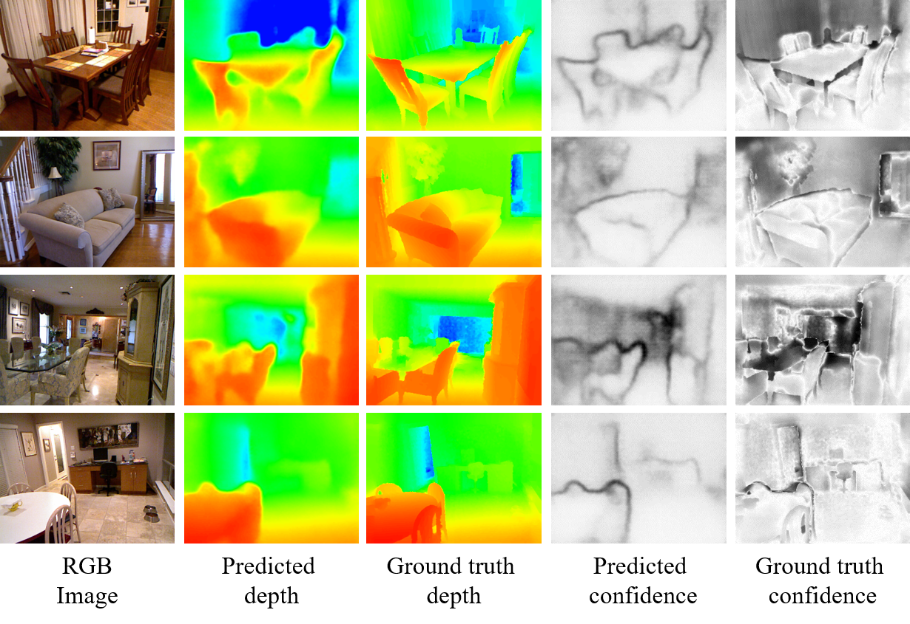

## BayesianDeNet

This is the implementation of our paper "Bayesian DeNet: Monocular Depth Prediction and Frame-wise Fusion with Synchronized Uncertainty".

The demo video is comming soon...  

### Dependences
* Tensorflow
* OpenCV
* Numpy
* Eigen

### Filelist.txt
> rgb/00000000.png, depth/00000000.png  
> rgb/00000001.png, depth/00000001.png  
> rgb/00000002.png, depth/00000002.png  
> ...

### Test
Run  

	python predict.py --rgb_path='rgb.png' --model_path='model' --depth_path='depth.png' --confidence_path='confidence.png'

### Train
To train the model, run 

	python train.py --filelist_path='filelist.txt' --pretrain_model_path='resnet50.npy' --output_models_dir='/home/xx/saved_models'

### Data Augmentation
Run  
 
	python data_aug.py

### Multi-frame Fusion
	cd fusion  
	mkdir build && cd build  
	cmake ..  && make -j4
	./fusion  
### Citation
If you find this code useful, please cite:
> @article{BayesianDeNet,  
>  &#160;&#160;&#160;&#160;&#160;&#160;&#160;&#160;title={Bayesian DeNet: Monocular Depth Prediction and Frame-wise Fusion with Synchronized Uncertainty},   
>  &#160;&#160;&#160;&#160;&#160;&#160;&#160;&#160;author={X. Yang and Y. Gao and H. Luo and C. Liao and  K. Cheng},   
>  &#160;&#160;&#160;&#160;&#160;&#160;&#160;&#160;journal={IEEE Transactions on Multimedia},    
>  &#160;&#160;&#160;&#160;&#160;&#160;&#160;&#160;year = {2019},  
> }